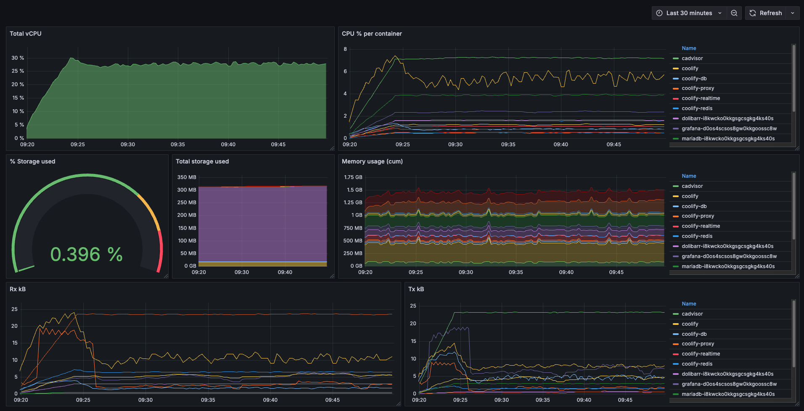

# Coolify Container Monitoring Resources

This repo contains resources and instructions on how to get set up with resource monitoring for your Coolify-managed docker containers using [Prometheus](https://prometheus.io/), [Grafana](https://grafana.com/) and [cAdvisor](https://github.com/google/cadvisor).



## Quick resource reference

- [Grafana dashboard](container-analysis-grafana-dash.json)
- [cAdvisor docker compose](cAdvisor.yaml)
- [Prometheus config](prometheus-config.yml)
- [Prometheus docker compose](prometheus-deployment.yml)

## Overview

This monitoring setup provides visibility into your overall docker metrics, as well as container metrics including:

- CPU usage
- Memory consumption
- Network traffic

The process is broken down into 5 steps:

1. Configuring Docker as a Prometheus target
2. Create cAdvisor service
3. Create Prometheus service
4. Create Grafana service
5. Import Grafana dashboard

## Pre-reqs

To be able to use the resources in this repository you must have a server onto which you've installed [Coolify](https://coolify.io/docs/get-started/installation).

## Setup instructions

### 1. Configuring Docker as a Prometheus target

In this step we allow Prometheus to scrape metrics from the Docker daemon. This gives allows you to monitor Docker itself.

If you are only interested in monitoring specific container metrics, you can skip to step 2.

#### Add metrics address to docker daemon:

Fist expose Prometheus-compatible metrics on port 9323 by adding the following property to your Docker daemon config json file:

```json
"metrics-addr": "0.0.0.0:9323"
```

On linux this can be found at `/etc/docker/daemon.json`.

You must then restart the docker service to load the new config:

```ssh
service docker restart
```

For more information, see [dockerdocs](https://docs.docker.com/engine/daemon/prometheus/)

### 2. Create cAdvisor service

> cAdvisor (Container Advisor) provides container users an understanding of the resource usage and performance characteristics of their running containers. It is a running daemon that collects, aggregates, processes, and exports information about running containers.

To run cAdvisor in Coolify, you need to create a new resource.

There is no one-click service for cAdvisor, so it needs to be deployed in a different way.

It's possible to use the Git-based public repo method or any of the Docker methods.

I chose to use a docker compose file, because that way I'm able to define the health check in the same config file as the rest of the service, instead of through the UI. [You can find the config file here](cAdvisor.yaml).

⚠️ I got caught out on this step because I'm using a Hetzner server. When I tried to pull the image from Google Container Registry I got a `403 Forbidden` error. I spent a few hours trying to configure Google credentials, set up a Cloudflare tunnel, even build the image on the server instead of pulling it in, before I realised that it was just a GeoIP issue that could be resolved by rotating both my Primary v4 and v6 IPs which were assigned to my server.

### 3a Create Prometheus config file

For this you will need to create a prometheus config file. For a remote server the easiest way is to SSH into the server and create the file there.

```ssh
touch /tmp/prometheus.yml

nano /tmp/prometheus.yml
```

Copy the contents of the [prometheus-config.yml](prometheus-config.yml) file into the new file.

This sets up prometheus scrape targets for **both the docker daemon and cAdvisor**. You can leave out the docker daemon scrape target if you only want to monitor specific container metrics.

### 3b Create prometheus service

To do this, follow the same steps as for cAdvisor, but instead of using the cAdvisor config, use [prometheus-deployment.yml](prometheus-deployment.yml) file.

### 4. Create Grafana service

Grafana can be deployed as a one-click service in Coolify.

When it's running, navigate to the Datasources tab and configure Prometheus as a datasource. The only thing that you should need to fill in is the URL, which you should set to `http://host.docker.internal:9090`

You should already be able to see your docker metrics when you go to the Explore tab.

### 5. Import Grafana dashboard

Once the Grafana service is running, you can import the dashboard configuration JSON file found [here](container-analysis-grafana-dash.json).

You should be prompted to select the Prometheus datasource you created in the previous step.

You should now be able to see your docker metrics in Grafana.
